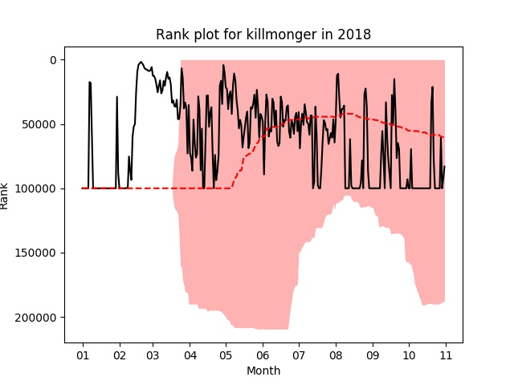
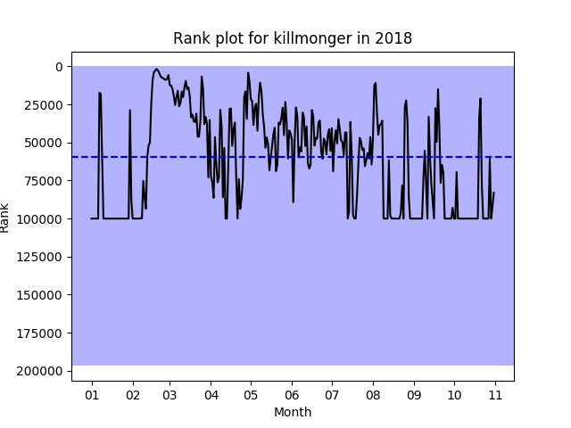
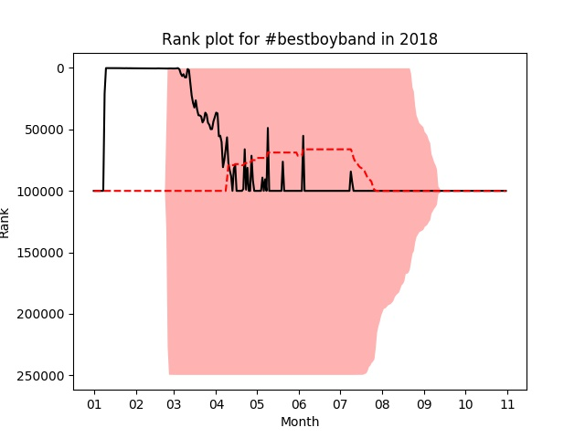
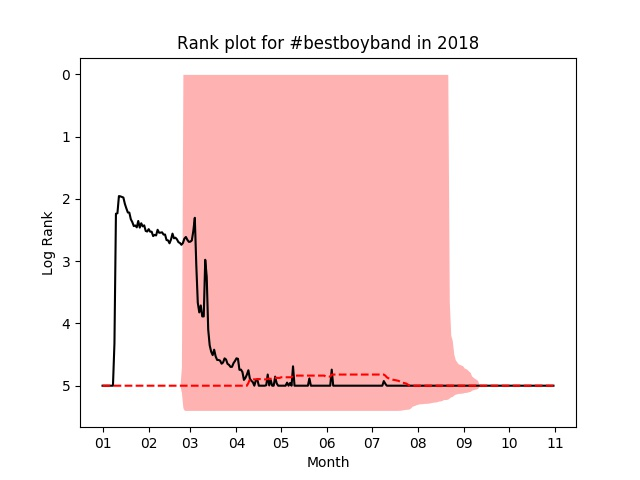
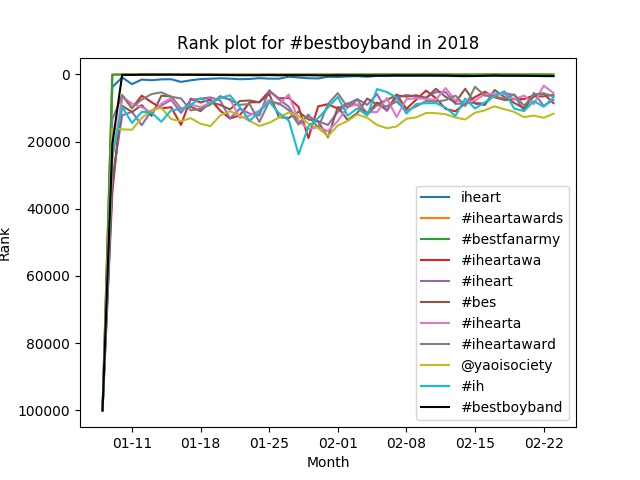
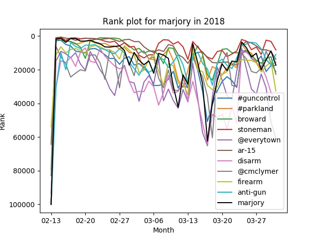
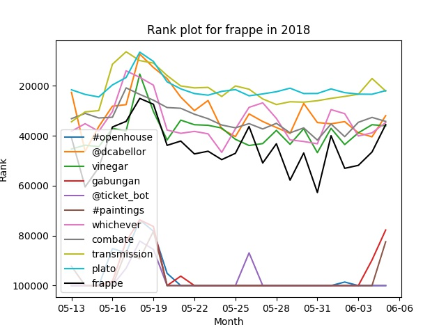

## Or More Accurately Discovering Emergence of Words

A PDF of my report can be found [here](report.pdf).
All code can be found on [my repository](https://github.com/brendanwhit/pocs-final-project).

## Introduction

I decided to look into the "shocking" events on Twitter to analyze what
types of events are talked about more than usual for a period of time.
Analysis of this phenomenon can give insights into the cycle of information
on social media platforms,
and the collective "memory" regarding certain events.
My aims were to characterize the most shocking words of 2018,
and then extract out the stories surrounding the sudden rise of a certain word.
The data comes from the daily rank plots for the top 100000 words
curated by Josh Minot from the Twitter Decahose for analysis.

## Methods

The methods employed for my project can be broken into two main components.
The first component is detecting and quantifying the shock events.
This is where most of my resources for the project were focused.
The second component of the project was attempting to tease out the "story"
behind the shocking event.

### Shock Event Detection

To determine the existence of a shocking event occurs for a word,
we must first establish a baseline for where we can expect that word to appear
in the daily ranks.
The median value of the ranks for the words is a good choice because the median
is relatively robust to the influence of outliers.
This is important because if a word has multiple shocking spikes throughout the
year,
we don't want prior events to potentially overshadow future shock events.
In addition to determining the median,
we will use the interquartile range (IQR) as the measure of spread for
which the word should appear.
The IQR represents the range that the middle 50% of the data occupies,
which is a bit narrow to detect outliers.
Thus,
to increase the scope of the baseline,
we consider any date where the word has a rank lower than
1.5&sdot;IQR below the 25th percentile to be a shocking appearance of the
word.
This metric is commonly used on box-and-whisker plots as a cutoff for outliers.
It is important to reiterate that a low rank indicates more frequent usage of
a word.

Another important aspect of the baseline is it must not consider ranks from 
future days.
This will allow for the detection of shock events as they occur rather than
in the posterior after the data has been collected for the complete time period
of interest.
Therefore,
the basline used for this project calculated the lower bound for the word at
each data based on the previous 6 months of rank data.

An example of where calculating the baseline from the full range of data 
obscuring a shocking event is with the word "killmonger".
Figure 1 indicates how calulating the baseline from the full
range of data,
represented by the blue shadow,
hides the shocking rise of "killmonger".  
The red baseline,
which indicates the baseline calculated using the previous 6 months of data
correctly indicates that "killmonger" was used much more frequently compared
to its previous use.
Thus we would consider the emergence of "killmonger" into the common
vocabulary as a shocking event.
Therefore,
we have shown that the calculation of our expected ranks from the prior
6 months is a useful technique.

 <figure>
  
  <figcaption> Figure 1: Two different applications of baseline
  calculations on the same "killmonger" rank data. The dashed lines
  in both plots represent the median for each date. The red area
  represents the baseline calculated from the prior 6 months of word
  rank data.  The blue area represents the baseline calculated from all the
  data in 2018. </figcaption>
 </figure>

The final step for the shock event detection was determining the size for
each continuous event.
To do that,
the shock events were first separated if there were multiple events.
Figure 2 represents the rank plot for the word "rip",
which has multiple spikes throughout 2018,
as an example of where a single word can have multiple shock events.
Once each shock event was separated,
the area between the lower bound and the ranks was calculated using
trapezoidal integration because the data is discrete.
The formula for trapezoidal integration used:

After calculating the area of each shock event,
I recorded the maximum shock event for each word to determine the most shocking
words.



With the formulas for finding shocking events and calculating the magnitude of
the maximum event for each word,
I used the mighty powers of the VACC (Vermont Advanced Computing Core)
to calulate the max shock event for a whole bunch of words.
The first section of words I ran on the VACC were the top 100000 popular words
by count in 2018.
To determine these words I counted the number of times a word appeared in the
daily ranks.
The top 100000 words consisted of all the words that appeared on the daily rank
lists at least 72 times in 2018.
This batch of words was labeled Emergent Words,
with justification in the Results section.

The next batch of words analyzed,
labeled Known Words,
consists of words that appeared at least 100 times in both 2017 and 2018.
The reason for requiring word appearances in 2017 comes from the dependency of
the 6-month prior baseline calculation in early 2018 on data from 2017.
This batch of words attempts to represent the words that some people might 
now from the previous year,
but they aren't necessarily commonplace words.
The filtering down to known words reduced the number of words analyzed to 
78027.

The final batch of words sent to the VACC,
labeled Popular Words,
consists of the words that appear every single day in both 2017 and 2018.
For the data analyzed,
this required 364 days in 2017,
and 304 days in 2018.
This batch of words attempts to represent the words that most people should
be familiar with,
and are commonly used.
The final filtering reduced the number of words analyzed to 36431.

### Story Detection

The story detection algorithm I used was fairly simple.
Once a shock event was calculated,
the rank of every word was pulled for the same time period as the shock event.
If a word was missing a rank for some of the days in that time period,
the missing ranks were filled with the value 100001.
Then all of the rank series for each word were mean normalized,
but not variance normalized.
The final step was calculating the squared error between the shocking word
and all of the other words on each day.
The top 10 words with the smallest cumulative squared error compared to the
shocking word were recorded as the story for the shocking event.
This method had varying degrees of success,
as is evident in the Results section.

## Results

The shock detection method heavily weighted words that had not appeared on the
rank lists prior to emergence.
This is logical because every value for rank for the word would be 100001,
which gives the upper bound for the detection method as 100001.
Thus,
any word that emerged on to the rank list had ~45 straight days of "shock"
before the new ranks would reach the 25th percentile.
The shock event scoring then had 45 timesteps to calculate the area between
the ranks of the word and 100001.
This was the cause of some massively inflated shock event scores.
Therefore,
for all of the top 10 most shocking words in the Emergent Words VACC run display this
emergence (hence the name).

The official most shocking word in 2018 according the word rank plots is
#bestboyband. 
Figure 3 shows the rank plot of the word #bestboyband in
normal scaling and log scaling.

 <figure>
  
  <figcaption> Figure 3: The rise to fame of the word #bestboyband
  in 2018.  The figure on the left is the rise plotted on a normal scale.
  The figure on the right is plotted on log scale. </figcaption>
 </figure>

#bestboyband jumped from nothingness to inside the top 100 words in the middle
of January.
It remained within the top 1000 words on Twitter until the shock detection
method finally caught up to the new status of the word and rendered it not 
shocking anymore.
This hashtag was used for a fan army contest amongst all of the boy bands
hosted by IHeartRadio.
The contest must have lasted for about two months as shown by the sharp decline
following the middle of March.
By the beginning of May,
#bestboyband is no longer consistently ranking in the top 100000 words used
on Twitter.
This is a striking display of a moment of rapid emergence,
lingering persistence of the idea,
and then immediate decay at the end of the contest.

Table 1 contains the top 10 most shocking events for the
following 3 categories:
Words,
Hashtags,
and Users.
As is evident by the tables,
some words that make it in must be part of a bigger word,
or some common phrase (see rate]).
All of the entries in this table,
except for #nbaplayoffs,
had never reached the top 100000 ranks for Twitter before their emergence
into the daily ranks.

<table>
<caption> Table 1: The 10 most shocking words in each category for the Emergent
Words corpus </caption>
<tr>
<th> Rank </th>
<th> Word </th>
<th> Hashtag </th>
<th> User </th>
</tr>
<tr>
<td> 1 </td>
<td> 'tear' </td>
<td> #bestboyband </td>
<td> @davidhogg111 </td>
</tr>
<tr>
<td> 2 </td>
<td> rate] </td>
<td> #marchforourlives </td>
<td> @emma4change </td>
</tr>
<td> 3 </td>
<td> marjory </td>
<td> #parkland </td>
<td> @sjofficial </td>
</tr>
<tr>
<td> 4 </td>
<td> come99 </td>
<td> #ninepercent </td>
<td> @jewepri_staff </td>
</tr>
<tr>
<td> 5 </td>
<td> stc79 </td>
<td> #nct2018 </td>
<td> @shindeshilpas </td>
</tr>
<tr>
<td> 6 </td>
<td> 4/23 </td>
<td> #greatawakening </td>
<td> @cameron_kasky </td>
</tr>
<tr>
<td> 7 </td>
<td> killmonger </td>
<td> #poshmark </td>
<td> @247jimin </td>
</tr>
<tr>
<td> 8 </td>
<td> descargables </td>
<td> #mdrive </td>
<td> @neiljedcastro </td>
</tr>
<tr>
<td> 9 </td>
<td> fessy </td>
<td> #fakelove </td>
<td> @jaclyncorin </td>
</tr>
<tr>
<td> 10 </td>
<td> stoneman </td>
<td> #nbaplayoffs </td>
<td> @projetocabrabr </td>
</tr>
</table>

Table 2 is the same table as Table~\ref{Tab:Emergent},
however the data is now for the Known Words corpus analyzed on the VACC.
More of these words are more associated with recurring themes,
like tv shows (#shameless, #wrestlemania),
and album releases ("kanye's").
These words could more feasibly be categorized as Recurring Words.
It is important to note that the number of required appearances in both
years is a key parameter to generating this list.
A more careful study of the influence of this parameter rather than an
arbitrary choice of 100 days could produce very interesting results.

<table>
<caption> Table 2: The 10 most shocking words in each category for the Known
Words corpus </caption>
<tr>
<th> Rank </th>
<th> Word </th>
<th> Hashtag </th>
<th> User </th>
</tr>
<tr>
<td> 1 </td>
<td> 010x2163x8847 </td>
<td> #bbnaija </td>
<td> @chuuzus </td>
</tr>
<tr>
<td> 2 </td>
<td> gander </td>
<td> #cncowners </td>
<td> @mariobautistamb </td>
</tr>
<tr>
<td> 3 </td>
<td> berinteraski </td>
<td> #wrestlemania </td>
<td> @huniverses </td>
</tr>
<tr>
<td> 4 </td>
<td> boo'd </td>
<td> #toulouse </td>
<td> @vivo_india </td>
</tr>
<tr>
<td> 5 </td>
<td> oylar </td>
<td> #backtoyou </td>
<td> @dismiss </td>
</tr>
<tr>
<td> 6 </td>
<td> sdcc </td>
<td> #mvsales </td>
<td> @baneandlewis </td>
</tr>
<tr>
<td> 7  </td>
<td> [08 </td>
<td> #shameless </td>
<td> @debryanshow </td>
</tr>
<tr>
<td> 8  </td>
<td> kayne's </td>
<td> #hwpl </td>
<td> @digvijaya_28 </td>
</tr>
<tr>
<td> 9 </td>
<td> currentcet </td>
<td> #mbs </td>
<td> @soonsvt </td>
</tr>
<tr>
<td> 10 </td>
<td> esquentar </td>
<td> #stevenuniverse </td>
<td> @amas </td>
</tr>
</table>

Table 3 is the final table representing the top ten shocking words
in each category among the words that were in the top 100000 rankings every
day.
One very evident trend is the usernames are almost exclusively large tech
companies.
A potential explanation for this phenomenon is the retweeting of announcements
that the company makes.
Or perhaps,
their representation in the shock table is indicative of news stories
circulating about them.
In either case,
a more careful examination using a better story detection method would prove
to be insightful.
The most shocking words from the Popular Corpus are more difficult to
pull out a trend just from appearances,
and as is shown below,
they do not perform well for the story extractor.

<table>
<caption> Table 3: The 10 most shocking words in each category for the Popular
Words corpus </caption>
<tr>
<th> Rank </th>
<th> Word </th>
<th> Hashtag </th>
<th> User </th>
</tr>
<tr>
<td> 1 </td>
<td> vineyard </td>
<td> #myfirsttweet </td>
<td> @itslifefact </td>
</tr>
<tr>
<td> 2 </td>
<td> staan </td>
<td> #cute </td>
<td> @wef </td>
</tr>
<tr>
<td> 3 </td>
<td> frappe </td>
<td> #hotel </td>
<td> @delta </td>
</tr>
<tr>
<td> 4 </td>
<td> puas </td>
<td> #nike </td>
<td> @giphy </td>
</tr>
<tr>
<td> 5 </td>
<td> brasiliera </td>
<td> #italia </td>
<td> @facebook </td>
</tr>
<tr>
<td> 6 </td>
<td> giovanna </td>
<td> #southkorea </td>
<td> @americanair </td>
</tr>
<tr>
<td> 7 </td>
<td> niemand </td>
<td> #artist </td>
<td> @r_sidney_v </td>
</tr>
<tr>
<td> 8 </td>
<td> vakit </td>
<td> #cinema </td>
<td> @amazon </td>
</tr>
<tr>
<td> 9 </td>
<td> pantera </td>
<td> #government </td>
<td> @applesupport </td>
</tr>
<tr>
<td> 10 </td>
<td> nyaman </td>
<td> #sunrise </td>
<td> @ajarabic </td>
</tr>
</table>

For the story extraction,
I found great story detection for the emergent words,
but the story detection method was not sucessful in finding the story
around shock events that weren't massive.
Figure 4 shows the story extractor getting very good results
for the most shocking word #bestboyband and marjory.
Most of the success in detecting these emerging stories stems from the
likelihood that the words associated with the shocking words had also
never entered the daily ranks before.
That coupled with the extremely steep rise from 100001 to under 1000 for
both words meant that the squared errors harshly punished words that did not
also exhibit such a large rise.
Therefore,
mean square error was a fantastic choice for story differentiation.

 <figure>
  
  <figcaption> Figure 4: The 10 words with the smallest mean square error with
respect to the shocking words #bestboyband (on the left) and marjory (on the
right). </figcaption>
 </figure>

When the story finder method is applied to the more popular words,
we do not get the striking results observed from the emergent word analysis.
Figure 5 shows the results from applying the story finder to
the words "kanye's",
from the Known Words Corpus,
and "frappe",
from the Popular Corpus.
These story plots do not appear to tease apart the supplemental information
surrounding these words.
More research is required to improve the story finding algorithm for spikes in
the more ingrained words.

 <figure>
  
  <figcaption> Figure 5: The 10 words with the smallest mean square error with
respect to the shocking words kanye's (on the left) and frappe (on the
right). </figcaption>
 </figure>

## Future Work

Moving forward with the project,
a few things would have to change to make this a more powerful shock detector.
Discovering emergence of words aside,
the current system did not do a fantastic job of teasing out the relevant
information surrounding spikes of certain words.
Perhaps ranking the correlations of the words that also spiked the same day
as the "shocking" word would yield better results for the words that did
not emerge onto the scene.
Correlations would capture,
and subsequently could weight,
the initial rise of the words more than the overall shape of the shocking event.
This could be more helpful for certain events,
deaths for example,
where the words accompanying the shocking word change over time.
For instance,
with a death,
the initial reactions are sad and filled with words like tragic, rip, etc.
Then the topics generally progress to rememberance of the person and their
accomplishments.
These two narratives tend to keep the person's name more popular,
thus extending the shock event.
Therefore,
when analyzing the mean square error over the entire shape of the shock event,
we miss out on both stories of the death.
I think this is a good start to an interesting problem, 
and I would love to expand upon the ideas presented in this paper.

